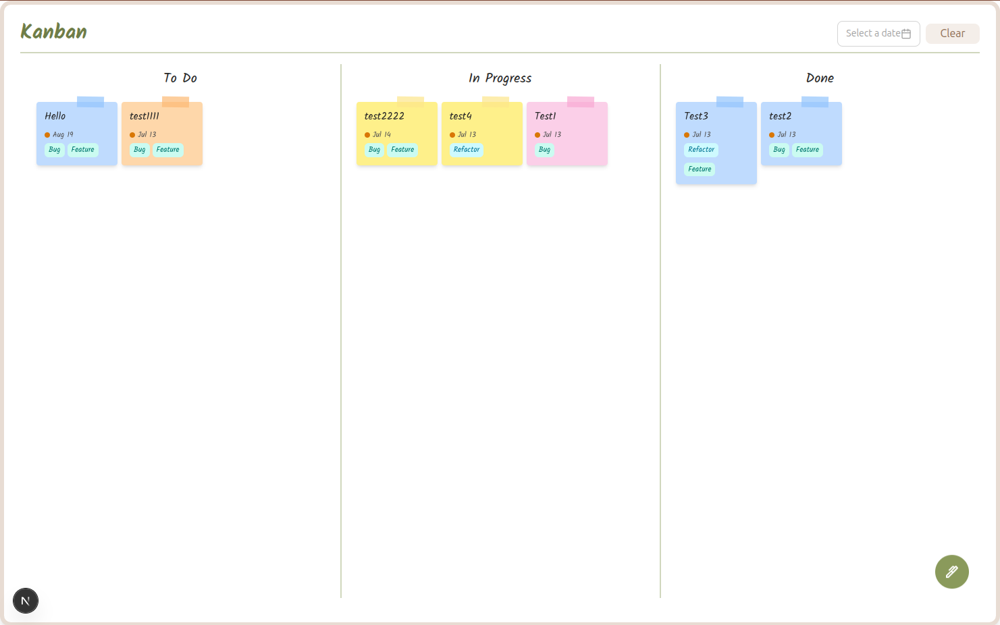

# Kanaban Board
-----------------
__A simple kanaban board for managing task.__

### Tech specification
* __Backend:__ `Django + DRF`
* __Frontend:__ `React/Next Js` with typescript
* __DB:__ `SQLite3` nb: We can change it to PostgreSQL

## Project Setup

* Clone project: `https://github.com/sudiptoshahin/kanaban-board`

* `cd kanaban-board`

* __Create environment:__ `python3 -m venv env`

* __Activate env:__ `source env/bin/activate`

* __Install libraries:__ `pip install -r requirements.txt`

* __Run migrations:__ `python manage.py makemigrations` & `python manage.py migrate`
* __Frontend:__
    * `cd kanaban-board/frontend`
    * `npm install` or `npm install -f`

* __Run project__
    * `cd kanaban-board/backend`
        * `python manage.py runserver`
    * `cd kanaban-board/frontend`
        * `npm run dev`

